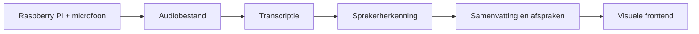

# Architectuur

EzelsOor volgt voor de hackathondemo één eenvoudige, lineaire flow.

## Gegevensstroom

1. De Raspberry Pi neemt een gesprek op via de aangesloten microfoon.
2. Het device maakt van de opname een audiobestand.
3. Het audiobestand wordt naar de backend verstuurd.
4. Azure-diensten zetten de audio om naar tekst en onderscheiden de sprekers.
5. Een taalmodel maakt van het transcript een samenvatting, afspraken en actiepunten.
6. De frontend presenteert het resultaat in een duidelijke, visuele vorm.

## Tussenresultaten

De integratie bestaat conceptueel uit vier overdrachten:

- **Opname:** audiobestand met minimale metadata, zoals tijdstip en duur.
- **Transcript:** tekstsegmenten met sprekerlabel en tijdsaanduiding.
- **Analyse:** samenvatting, afspraken, actiepunten en eventueel open vragen.
- **Presentatie:** status en resultaten in een vorm die de frontend direct kan tonen.

Exacte bestandsformaten, API's en datamodellen worden tijdens de hackathon gekozen en daarna vastgelegd in `shared/contracts/`.

## Frontendbeeld

De frontend legt nadruk op snelle interpretatie van een gesprek:

- duidelijk onderscheid tussen sprekers;
- navigeerbaar transcript met tijdsaanduidingen;
- compacte samenvatting;
- herkenbare afspraken en actiepunten;
- zichtbare verwerkingsstatus en fouten.

Dit document beschrijft alleen de beoogde flow. Het legt nog geen technische implementatie vast.
